# MERN Thinkboard 📋

MERN Thinkboard is a premium, full-stack notes management application. It serves as a dashboard where users can perform complete **CRUD operations** (Create, Read, Update, Delete) on notes. The project features automated **Rate Limiting** backed by Redis to prevent spamming and slow down API requests under load, complete with custom UI fallback states.

---

## 🏗️ System Architecture & Data Flow

Below is a system architecture diagram showing how the React frontend client communicates with the Express backend, MongoDB database, and Upstash Redis cache layer:

```mermaid
sequenceDiagram
    actor User as User Browser
    participant React as React Frontend (Vite)
    participant Express as Node/Express Backend
    participant Redis as Upstash Redis (Rate Limiter)
    participant MongoDB as MongoDB (Mongoose ORM)

    User->>React: Interacts with UI (Create/Edit/Delete Note)
    React->>Express: API request via Axios (GET, POST, PUT, DELETE)
    
    rect rgb(20, 30, 40)
        Note over Express, Redis: Rate Limiting Check
        Express->>Redis: Check client IP request count
        Redis-->>Express: Returns request status (Within limit / Rate limited)
    end

    alt Client is Rate Limited (HTTP 429)
        Express-->>React: Send HTTP 429 Too Many Requests
        React-->>User: Show RateLimitedUI screen ("Slow down!")
    else Client is Allowed
        Express->>MongoDB: Queries Note model (findById, save, delete)
        MongoDB-->>Express: Returns query result (JSON Note document)
        Express-->>React: Returns JSON payload + HTTP 200/201 Success
        React-->>User: Updates Controlled UI State & triggers toast alerts
    end
```



---

## 🛠️ Technology Stack

### Frontend Component
* **Framework**: React 19 (Vite)
* **Styling**: Tailwind CSS v4 & DaisyUI v5 (using the `forest` dark theme)
* **Routing**: React Router v8 (for declarative navigation)
* **API Client**: Axios (configured with a custom instance in [axios.js](file:///Users/nihal/Desktop/MERN-THINKBOARD/frontend/src/lib/axios.js))
* **Notifications**: React Hot Toast (for interactive alerts)
* **Icons**: Lucide React

### Backend Component
* **Runtime**: Node.js & Express
* **Database**: MongoDB Atlas (managed via [Mongoose ORM](file:///Users/nihal/Desktop/MERN-THINKBOARD/backend/src/config/db.js))
* **Rate Limiter Cache**: Upstash Redis (configured in [upstash.js](file:///Users/nihal/Desktop/MERN-THINKBOARD/backend/src/config/upstash.js))
* **Security & Configuration**: Dotenv & CORS middleware

---

## 🗄️ Database Schema (Note Model)

The database documents are structured using the [Note.js](file:///Users/nihal/Desktop/MERN-THINKBOARD/backend/src/models/Note.js) model. Mongoose handles validation and automatically appends audit timestamps.

| Field Name | Data Type | Required | Description |
| :--- | :--- | :---: | :--- |
| `_id` | `ObjectId` | Yes (Auto) | Unique database primary key |
| `title` | `String` | **Yes** | The headline of the note |
| `content` | `String` | **Yes** | The core body text of the note |
| `createdAt`| `Date` | Yes (Auto) | Timestamp recording when the note was created |
| `updatedAt`| `Date` | Yes (Auto) | Timestamp recording when the note was last modified |

---

## ⚙️ Getting Started & Installation

### Prerequisite Configurations
Before running the servers, you must set up your environment variables. 
1. In the root, check the global [.gitignore](file:///Users/nihal/Desktop/MERN-THINKBOARD/.gitignore) file. It ensures your secrets are never tracked.
2. In the `backend` folder, duplicate `env.example` to create a local environment file:
   ```bash
   cp backend/.env.example backend/.env
   ```
3. Populate `backend/.env` with your actual MongoDB Connection URI and Upstash Redis URL/Token.

### 🏃 Running the Application

To run the application locally, you must start both the backend server and the frontend development server:

#### 1. Backend Server Setup
Navigate into the backend workspace, install dependencies, and run the developer server:
```bash
cd backend
npm install
npm run dev
```
The server will run on `http://localhost:5001`.

#### 2. Frontend Client Setup
In a new terminal window, navigate into the frontend workspace, install dependencies, and run the client dev server:
```bash
cd frontend
npm install
npm run dev
```
The development server will run on `http://localhost:5173`.
